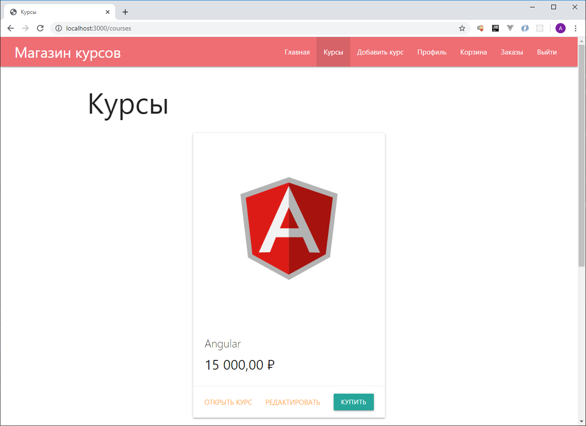

# Courses Store
Первое приложение написанное в рамках учебного курса ["Node JS. Практический курс. (Mongo, GraphQL, MySQL, Express)"](https://www.udemy.com/course/nodejs-full-guide/).

Представляет из себя прототип интернет-магазина по продаже онлайн-курсов. Является примером fullstack-приложения, использующего связку **Node.js + Express.js + MongoDB + Handlebars + SendGrid**. На текущий момент в приложении реализованы следующие возможности:

- Аутентификация и регистрация пользователей
- Функционал восстановления забытого пароля
- Редактирование профиля пользователя
- Добавление и редактирование курсов
- Вывод списка всех имеющихся курсов
- Функционал добавления курсов в корзину
- История совершенных заказов

# How to use?

Перед запуском приложения необходимо выполнить настройку конфигурации.

Для запуска в **dev** режиме необходимо прописать свои настройки в файле **keys/keys.dev.js**.

Для запуска в **prod** режиме необходимо передать свои настройки через **env-переменные**. 

Используемые настройки:

- **MONGODB_URI** - connection string для подключения к СУБД MongoDB
- **SESSION_SECRET** - секретная строка для вычисления хеша сессий
- **SENDGRID_API_KEY** - ключ для подключения к аккаунту на сайте [sendgrid.com](https://sendgrid.com/)
- **EMAIL_FROM** - email, с которого будут приходить оповещения с магазина
- **BASE_URL** - URL для перехода в магазин

# Example
